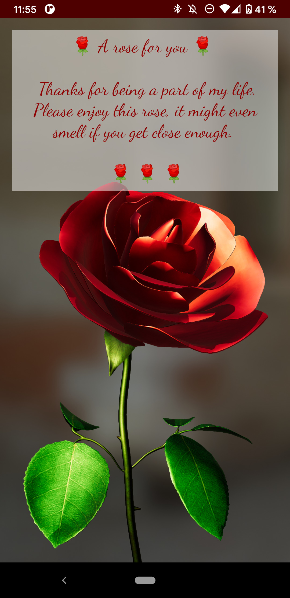
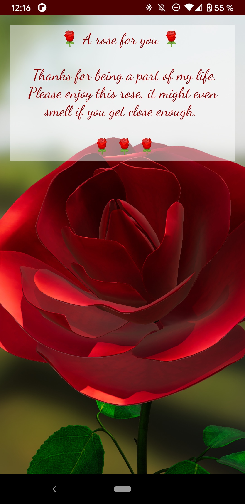
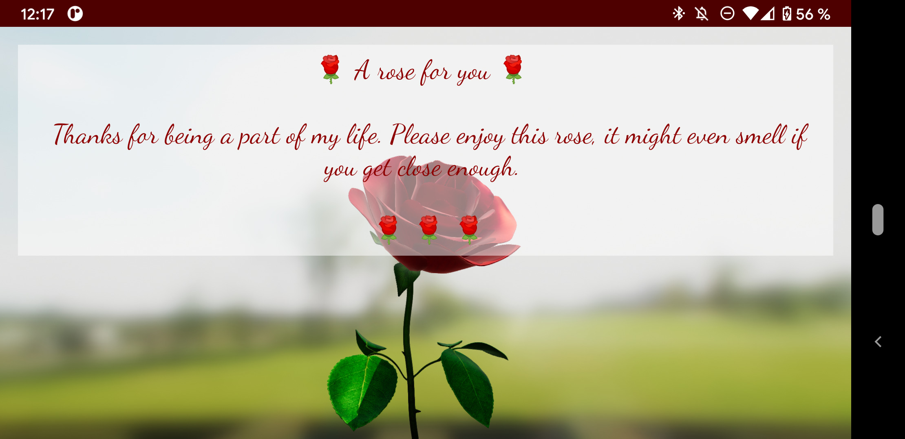

# IWD App: Rose

This rose is a present to all the women in my life. Thank you for being part of it.

It heavily uses the tutorials for Android Filament on [Medium by Philip Rideout](https://medium.com/@philiprideout/getting-started-with-filament-on-android-d10b16f0ec67) and the official [Google Filament for Android examples](https://github.com/google/filament/tree/main/android/samples). The rose itself is "bought" from [TurboSquid](https://www.turbosquid.com/3d-models/3d-model-rose-1242547), translated, scaled and slightly altered by using [blender](http://blender.org/) (Remember to use `--python-use-system-env` for the GLB export to find Numpy).

## Adding new environments

If you feel the backgrounds of the rose, changeable by restarting the app, or tapping on the text, needs more options, please feel free to add a png to the [./assets](./assets), run the [create envs script](assets/create_envs.sh), if you got the [fillament tools](https://github.com/google/filament/releases/latest) installed or on your path.

## Screenshots

<table>
 <tr>
  <td></td>
  <td></td>
  <td></td>
 </tr>
</table>

## Google Play Store

If you simply want to install the app, you can find it on [Google Play Store](https://play.google.com/store/apps/details?id=jetzt.jfdi.iwd.rose). (review pending)

# IWD Challenge

Additionally this app serves as an inspration for the [GDG Berlin Android IWD Challenge: Build an App for the Women in your lifes](https://twitter.com/Berlindroid/status/1367894353650323458?s=20), running outside of the challenge.

If you want to contribute your own app praising the women in your life, please checkout aboves tweet, by the end of the Friday 12th of March 2021.
